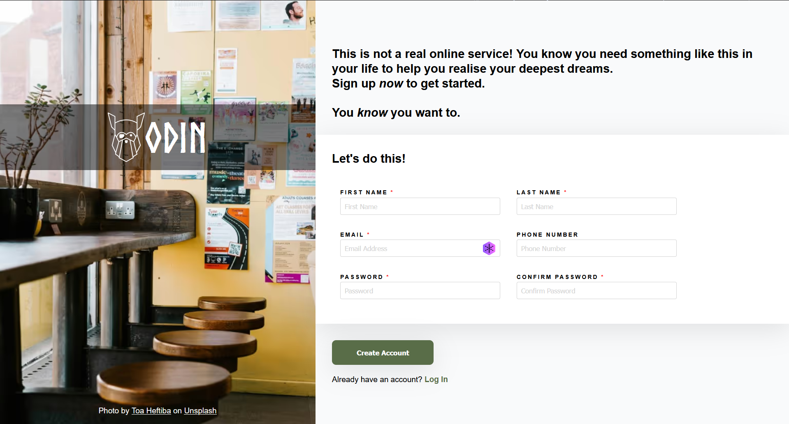
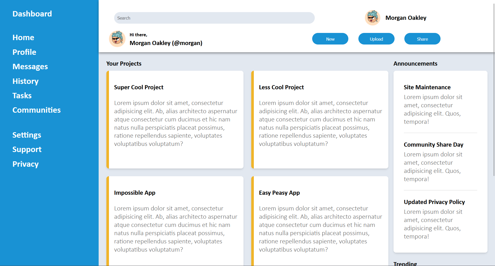
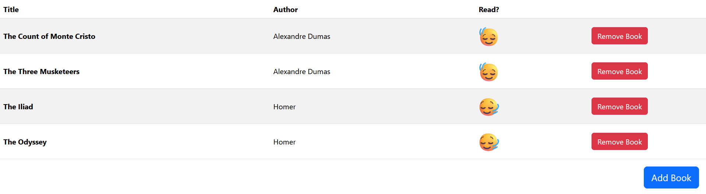
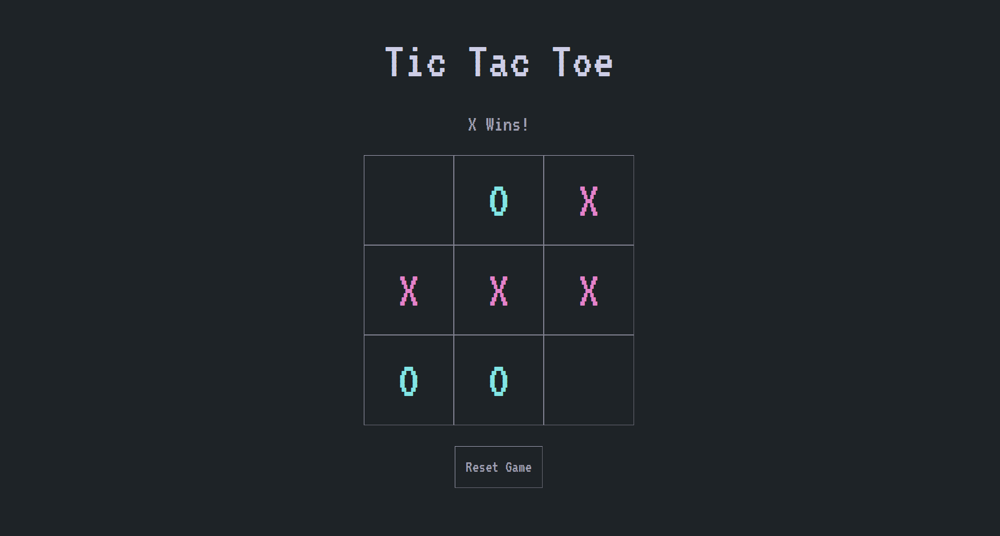
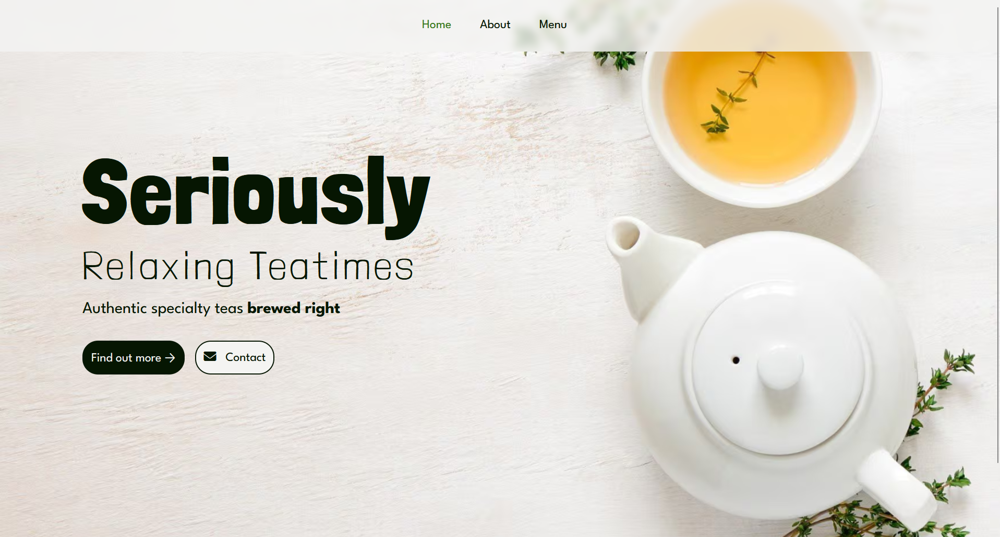
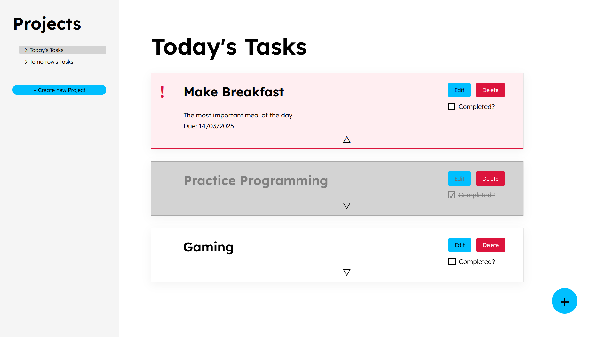
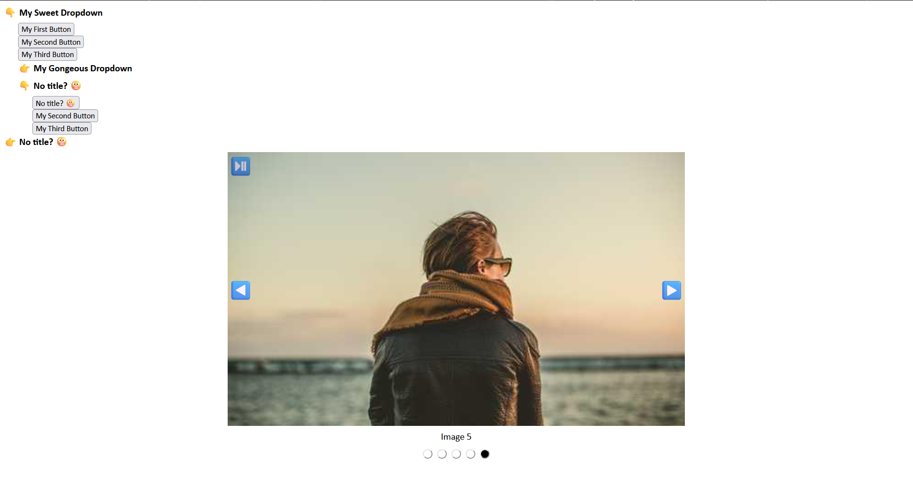

# The Odin Project: Full Stack JavaScript Path

This repository contains all the projects I’ve built as part of The Odin Project’s Full Stack JavaScript Path. Below are some of the projects that you can explore.

## Projects

### 1. **Sign-Up Form**

**[Live Preview](https://robeecodes.github.io/top-full-stack-javascript/sign-up-form/)** |
[View on GitHub](https://github.com/robeecodes/top-full-stack-javascript/tree/main/sign-up-form)  
A simple, responsive form where users can sign up with their details. Includes form validation and interactive elements.



---

### 2. **Admin Dashboard**

**[Live Preview](https://robeecodes.github.io/top-full-stack-javascript/admin-dashboard/)** |
[View on GitHub](https://github.com/robeecodes/top-full-stack-javascript/tree/main/admin-dashboard)  
An admin dashboard built to practice my CSS Grid skills.



---

### 3. **Library**

**[Live Preview](https://robeecodes.github.io/top-full-stack-javascript/library/)** |
[View on GitHub](https://github.com/robeecodes/top-full-stack-javascript/tree/main/library)  
A simple library app where users can add, remove, and mark books as read. It uses JavaScript for DOM manipulation.



---

### 4. **Tic Tac Toe**

**[Live Preview](https://robeecodes.github.io/top-full-stack-javascript/tic-tac-toe/)** |
[View on GitHub](https://github.com/robeecodes/top-full-stack-javascript/tree/main/tic-tac-toe)  
A classic Tic Tac Toe game implemented using JavaScript. The game allows two players to compete in a browser.
  


---

### 5. **Restaurant**

**[Live Preview](https://robeecodes.github.io/top-full-stack-javascript/restaurant/dist/)** |
[View on GitHub](https://github.com/robeecodes/top-full-stack-javascript/tree/main/restaurant)  
A restaurant website showcasing different sections in a single-page app. Built to practice DOM manipulation in JavaScript.



---

### 6. **To Do App**

**[Live Preview](https://robeecodes.github.io/top-full-stack-javascript/todo/dist/)** |
[View on GitHub](https://github.com/robeecodes/top-full-stack-javascript/tree/main/todo)  
A to do app built to practice MVC design pattern, DOM manipulation and localstorage access.



---

### 6.5. **Custom Dropdown and Carousel**

**[Live Preview](https://robeecodes.github.io/top-full-stack-javascript/dropdown-and-carousel/src/)** |
[View Code on GitHub](https://github.com/robeecodes/top-full-stack-javascript/tree/main/dropdown-and-carousel)  
Bonus demonstration of creating custom elements with [JavaScript Web Components](https://developer.mozilla.org/en-US/docs/Web/API/Web_components/Using_custom_elements). Note the usage of [WAI-ARIA Patterns](https://www.w3.org/WAI/ARIA/apg/patterns/carousel)



## Tech Stack ⚙️

- **HTML5** - Structure of the web pages
- **CSS3** - Styling and responsiveness
- **JavaScript** - Core functionality and logic
- **Git & GitHub** - Version control and project management
- **GitHub Pages** - Hosting the live demo of each project

## Getting Started

To get started with any of the projects, simply clone the repository:

```bash
git clone https://github.com/robeecodes/top-full-stack-javascript.git
```

Navigate to the specific project folder, and you can open it directly in your browser to view or edit the files.

## Connect with Me! 🌍

- [My Portfolio](https://digital-robin.com)
- [LinkedIn](https://www.linkedin.com/in/robin-kingy/)
